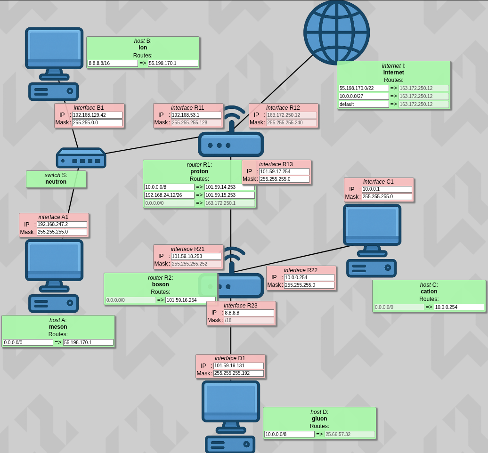

*This project has been created as part of the 42 curriculum by earutiun*

# NetPractice

## Description
This activity is a general practical exercise designed to introduce one to the basics of
computer networking. Its goal is to learn how to configure IP addresses, connect devices
through a router, and understand the role of a gateway within a network.

## Instructions
### Running the Training Interface
1. Download *net_practice.tgz* from 42 Intra page and extract it.
1. Open the file *index.html* to run all levels from 1 to 10 (or alternatively open an html file for the desired level).
1. For each level, a non-functioning network diagram appears. Configure the network according to the requirements until all connections are valid.
1. There are two buttons at the top of your window you can use:
  - **[Check again]** to verify if your configuration is correct or not.
  - **[Get my config]** to download your configuration.

### Submission Requirements
- The repository must contain exactly 10 exported configuration files.
- Each file corresponds to one NetPractice level.
- All 10 files must be placed at the root of the repository.

## Resources
### [Computer Networks by Andrey Sozykin (Youtube - RU)](https://www.youtube.com/watch?v=OLFA0soYGhw&list=PLtPJ9lKvJ4oiNMvYbOzCmWy6cRzYAh9B1)
- Computer networks
- Protocols & interfaces
- OSI model
- Packet forwarding
- TCP/IP addressing
- MAC vs IP addressing
- Role of routers and switches
### [You Suck at Subnetting by NetworkChuck (Youtube)](https://www.youtube.com/watch?v=5WfiTHiU4x8&list=PLIhvC56v63IKrRHh3gvZZBAGvsvOhwrRF)
- Subnetting
- Subnet mask
- Network and broadcast addresses
- IP range calculation
### AI tools (ChatGPT, Gemini, Grok)
- Routing
- Default gateway
- additional Q&A

## Example

